# Mermaid Class Diagram

This Mermaid class diagram focuses on the production code structure so it can be translated into a UML class diagram more easily.

```mermaid
classDiagram

namespace domain {
    class Combatant {
        <<abstract>>
        -name : String
        -maxHp : int
        -baseAttack : int
        -attack : int
        -defense : int
        -speed : int
        -currentHp : int
        -specialSkillCooldown : int
        +beginTurn() void
        +receiveDamage(damage:int) void
        +heal(amount:int) void
        +adjustAttack(amount:int) void
        +addStatusEffect(effect:StatusEffect) void
        +getActiveStatusNames() List~String~
        +openTurnWindow() TurnWindow
    }

    class PlayerCharacter {
        <<abstract>>
    }

    class Warrior
    class Wizard
    class Goblin
    class Wolf

    class StatusEffect {
        <<interface>>
        +getName() String
        +onTurnOpportunity() TurnEffectResolution
        +isExpired() boolean
    }

    class StunStatusEffect {
        -blockedTurnsRemaining : int
    }

    class TurnEffectResolution {
        -blocksAction : boolean
        -blockerLabel : String
        -notes : List~String~
    }

    class TurnWindow {
        -blocked : boolean
        -blockerLabel : String
        -notes : List~String~
    }

    class Inventory {
        -itemCounts : EnumMap~ItemType, Integer~
        +add(itemType:ItemType, count:int) void
        +countOf(itemType:ItemType) int
        +use(itemType:ItemType) void
        +snapshot() Map~ItemType, Integer~
    }

    class ItemType {
        <<enumeration>>
        POTION
        POWER_STONE
        SMOKE_BOMB
    }
}

namespace actions {
    class ActionExecutionContext {
        <<interface>>
        +getLivingEnemies() List~Combatant~
        +getLivingEnemiesInTurnOrder() List~Combatant~
        +getInventory() Inventory
        +activateSmokeBomb() void
        +adjustDamage(actor:Combatant, target:Combatant, baseDamage:int, notes:List~String~) int
    }

    class BattleAction {
        <<interface>>
        +getName() String
        +advancesCooldown() boolean
        +execute(context:ActionExecutionContext, actor:Combatant, target:Combatant) List~BattleEvent~
    }

    class BasicAttackAction
    class ShieldBashAction {
        -startsCooldown : boolean
    }
    class ArcaneBlastAction {
        -startsCooldown : boolean
    }
    class UsePotionAction
    class UseSmokeBombAction
    class UsePowerStoneSkillAction {
        -delegatedSkillAction : BattleAction
    }
}

namespace report {
    class BattleEvent {
        <<interface>>
    }

    class ActionEvent {
        -actorName : String
        -actionName : String
        -targetName : String
        -hpBefore : int
        -hpAfter : int
        -damage : int
        -notes : List~String~
    }

    class RoundStartEvent {
        -roundNumber : int
    }

    class SkippedTurnEvent {
        -combatantName : String
        -reason : String
        -notes : List~String~
    }

    class NarrationEvent {
        -text : String
    }

    class CombatantSummary {
        -name : String
        -currentHp : int
        -maxHp : int
        -currentAttack : int
        -baseAttack : int
        -alive : boolean
        -activeStatuses : List~String~
    }

    class RoundSummaryEvent {
        -roundNumber : int
        -playerSummary : CombatantSummary
        -enemySummaries : List~CombatantSummary~
        -inventorySnapshot : Map~ItemType, Integer~
        -specialSkillCooldown : int
    }
}

namespace engine {
    class TurnOrderStrategy {
        <<interface>>
        +determineOrder(combatants:List~Combatant~) List~Combatant~
    }

    class SpeedTurnOrderStrategy

    class PlayerDecisionProvider {
        <<interface>>
        +decide(roundNumber:int, player:PlayerCharacter, livingEnemies:List~Combatant~) PlayerDecision
    }

    class ScriptedDecisionProvider {
        -decisionsByRound : Map~Integer, PlayerDecision~
        +addDecision(roundNumber:int, decision:PlayerDecision) ScriptedDecisionProvider
    }

    class PlayerDecision {
        -action : BattleAction
        -targetName : String
    }

    class BattleSetup {
        -player : PlayerCharacter
        -initialEnemies : List~Combatant~
        -backupEnemies : List~Combatant~
        -inventory : Inventory
    }

    class EasyLevelSetup {
        <<utility>>
        +createWarriorPotionSmokeBombSetup() BattleSetup
    }

    class MediumLevelSetup {
        <<utility>>
        +createWarriorPowerStonePotionSetup() BattleSetup
        +createWizardPowerStonePotionSetup() BattleSetup
    }

    class ScenarioScript {
        -name : String
        -battleSetup : BattleSetup
        -decisionProvider : PlayerDecisionProvider
        -roundCount : int
    }

    class AppendixAScenarios {
        <<utility>>
        +all() List~ScenarioScript~
        +easyWarrior() ScenarioScript
        +mediumWarrior() ScenarioScript
        +mediumWizard() ScenarioScript
    }

    class BattleEngine {
        -player : PlayerCharacter
        -initialEnemies : List~Combatant~
        -reserveEnemies : List~Combatant~
        -spawnedEnemies : List~Combatant~
        -inventory : Inventory
        -turnOrderStrategy : TurnOrderStrategy
        -enemyBasicAttack : BattleAction
        -events : List~BattleEvent~
        -smokeBombEnemyAttackCharges : int
        +runRounds(roundCount:int, provider:PlayerDecisionProvider) List~BattleEvent~
    }
}

namespace ui {
    class BattleConsoleFormatter {
        +format(events:List~BattleEvent~) List~String~
    }

    class EasyRoundsDemo {
        +main(args:String[]) void
    }
}

Combatant <|-- PlayerCharacter
PlayerCharacter <|-- Warrior
PlayerCharacter <|-- Wizard
Combatant <|-- Goblin
Combatant <|-- Wolf

StatusEffect <|.. StunStatusEffect
Combatant *-- StatusEffect : statusEffects
StatusEffect --> TurnEffectResolution : returns
Combatant --> TurnWindow : creates

BattleAction <|.. BasicAttackAction
BattleAction <|.. ShieldBashAction
BattleAction <|.. ArcaneBlastAction
BattleAction <|.. UsePotionAction
BattleAction <|.. UseSmokeBombAction
BattleAction <|.. UsePowerStoneSkillAction
UsePowerStoneSkillAction --> BattleAction : delegates to
ShieldBashAction ..> StunStatusEffect : applies

BattleEvent <|.. ActionEvent
BattleEvent <|.. RoundStartEvent
BattleEvent <|.. SkippedTurnEvent
BattleEvent <|.. NarrationEvent
BattleEvent <|.. RoundSummaryEvent
RoundSummaryEvent --> CombatantSummary : contains
RoundSummaryEvent --> ItemType : inventorySnapshot

TurnOrderStrategy <|.. SpeedTurnOrderStrategy
PlayerDecisionProvider <|.. ScriptedDecisionProvider
BattleEngine ..|> ActionExecutionContext

PlayerDecision --> BattleAction : selected action
BattleSetup --> PlayerCharacter : player
BattleSetup --> Combatant : initial/backup enemies
BattleSetup --> Inventory : inventory
ScenarioScript --> BattleSetup : uses
ScenarioScript --> PlayerDecisionProvider : uses

BattleEngine --> TurnOrderStrategy : uses
BattleEngine --> PlayerDecisionProvider : queries
BattleEngine --> PlayerDecision : consumes
BattleEngine --> BattleAction : executes
BattleEngine --> BattleEvent : emits
BattleEngine --> Combatant : manages
BattleEngine --> Inventory : uses

EasyLevelSetup ..> BattleSetup : creates
MediumLevelSetup ..> BattleSetup : creates
AppendixAScenarios ..> ScenarioScript : creates

BattleConsoleFormatter --> BattleEvent : formats
BattleConsoleFormatter --> RoundSummaryEvent : reads
EasyRoundsDemo ..> AppendixAScenarios : runs
EasyRoundsDemo ..> BattleEngine : creates
EasyRoundsDemo ..> BattleConsoleFormatter : uses
```

## Notes

- This version focuses on production classes, not test classes, to keep the UML translation cleaner.
- If you want, a second Mermaid sequence diagram can be generated for one Appendix A battle flow as well.
