# Mermaid UML Sequence Diagram

This sequence diagram now models only the custom battle-flow validation scenario. It keeps the current live CLI architecture, but groups the interaction into readable phases: Wave 1 control, backup spawn, Wave 2 control, and the cooldown-blocked fallback on Round 12.

```mermaid
sequenceDiagram
    actor Player
    participant UI as "ConsoleBattleUi <<boundary>>"
    participant Decision as "CliPlayerDecisionProvider <<boundary>>"
    participant Engine as "BattleEngine <<control>>"
    participant Listener as "BattleEventListener <<control>>"
    participant Formatter as "BattleConsoleFormatter <<boundary>>"
    participant Warrior as "Warrior <<entity>>"
    participant Goblin as "Goblin <<entity>>"
    participant Wolf as "Wolf <<entity>>"
    participant WolfA as "Wolf A <<entity>>"
    participant WolfB as "Wolf B <<entity>>"
    participant BasicAttack as "BasicAttackAction <<entity>>"
    participant Defend as "DefendAction <<entity>>"
    participant ShieldBash as "ShieldBashAction <<entity>>"
    participant SmokeBomb as "UseSmokeBombAction <<entity>>"
    participant Potion as "UsePotionAction <<entity>>"

    Note over Player,UI: Custom battle-flow validation scenario

    rect rgb(245,245,245)
        Note over Engine,Wolf: Wave 1, Round 1
        Engine->>Wolf: selectAction(context)
        Wolf-->>Engine: BasicAttackAction
        Engine->>BasicAttack: execute(context, Wolf, Warrior)
        BasicAttack-->>Engine: ActionEvent(Warrior HP 260 -> 235)
        Engine->>Listener: onEvent(ActionEvent)
        Listener->>Formatter: format([ActionEvent])
        Formatter-->>Listener: attack line
        Listener->>UI: showBattleLines(lines)

        Engine->>Decision: decide(1, Warrior, livingEnemies)
        Decision->>UI: showPlayerTurn(...)
        UI-->>Player: display actions
        Player->>UI: choose Shield Bash on Wolf
        UI-->>Decision: action + target
        Decision-->>Engine: PlayerDecision(UseSpecialSkill, Wolf)
        Engine->>ShieldBash: execute(context, Warrior, Wolf)
        ShieldBash-->>Engine: ActionEvent(Wolf HP 40 -> 5, STUNNED)
        Engine->>Listener: onEvent(ActionEvent)
        Listener->>Formatter: format([ActionEvent])
        Formatter-->>Listener: action line
        Listener->>UI: showBattleLines(lines)

        Engine->>Goblin: selectAction(context)
        Goblin-->>Engine: BasicAttackAction
        Engine->>BasicAttack: execute(context, Goblin, Warrior)
        BasicAttack-->>Engine: ActionEvent(Warrior HP 235 -> 220)
        Engine->>Listener: onEvent(ActionEvent)
        Listener->>Formatter: format([ActionEvent])
        Formatter-->>Listener: attack line
        Listener->>UI: showBattleLines(lines)
    end

    rect rgb(235,245,255)
        Note over Engine,Wolf: Wave 1, Rounds 2 to 4
        Engine->>Wolf: openTurnWindow()
        Wolf-->>Engine: TurnWindow(blocked by stun)
        Engine->>Listener: onEvent(SkippedTurnEvent)
        Listener->>Formatter: format([SkippedTurnEvent])
        Formatter-->>Listener: skip line
        Listener->>UI: showBattleLines(lines)

        Engine->>Decision: decide(2, Warrior, livingEnemies)
        UI-->>Player: choose Smoke Bomb
        Decision-->>Engine: PlayerDecision(UseSmokeBomb, none)
        Engine->>SmokeBomb: execute(context, Warrior, null)
        SmokeBomb-->>Engine: NarrationEvent
        Engine->>Listener: onEvent(NarrationEvent)
        Listener->>Formatter: format([NarrationEvent])
        Formatter-->>Listener: narration line
        Listener->>UI: showBattleLines(lines)

        Engine->>Goblin: selectAction(context)
        Goblin-->>Engine: BasicAttackAction
        Engine->>BasicAttack: execute(context, Goblin, Warrior)
        BasicAttack-->>Engine: ActionEvent(0 damage, Smoke Bomb active)
        Engine->>Listener: onEvent(ActionEvent)
        Listener->>Formatter: format([ActionEvent])
        Formatter-->>Listener: protected attack line
        Listener->>UI: showBattleLines(lines)

        Engine->>Decision: decide(3, Warrior, livingEnemies)
        UI-->>Player: choose BasicAttack on Wolf
        Decision-->>Engine: PlayerDecision(BasicAttack, Wolf)
        Engine->>BasicAttack: execute(context, Warrior, Wolf)
        BasicAttack-->>Engine: ActionEvent(Wolf HP 5 -> 0, ELIMINATED)

        Engine->>Decision: decide(4, Warrior, livingEnemies)
        UI-->>Player: choose Defend
        Decision-->>Engine: PlayerDecision(Defend, none)
        Engine->>Defend: execute(context, Warrior, null)
        Defend-->>Engine: NarrationEvent(DEF +10)
        Engine->>Goblin: selectAction(context)
        Engine->>BasicAttack: execute(context, Goblin, Warrior)
        BasicAttack-->>Engine: ActionEvent(Warrior HP 220 -> 215, dmg 5)
    end

    rect rgb(245,255,235)
        Note over Engine,Goblin: Wave 1, Rounds 5 to 8
        Engine->>Decision: decide(5, Warrior, livingEnemies)
        UI-->>Player: choose Shield Bash on Goblin
        Decision-->>Engine: PlayerDecision(UseSpecialSkill, Goblin)
        Engine->>ShieldBash: execute(context, Warrior, Goblin)
        ShieldBash-->>Engine: ActionEvent(Goblin HP 55 -> 30, STUNNED)

        loop Goblin stunned skip and Warrior cleanup
            Engine->>Goblin: openTurnWindow()
            Goblin-->>Engine: TurnWindow(blocked by stun)
            Engine->>Decision: decide(next round, Warrior, livingEnemies)
            UI-->>Player: choose BasicAttack / Potion / BasicAttack
            Decision-->>Engine: PlayerDecision(...)
        end

        Engine->>Potion: execute(context, Warrior, null)
        Potion-->>Engine: NarrationEvent(Warrior HP 215 -> 260)
        Engine->>BasicAttack: execute(context, Warrior, Goblin)
        BasicAttack-->>Engine: ActionEvent(Goblin HP 5 -> 0, ELIMINATED)

        Engine->>Listener: onEvent(NarrationEvent: Backup Spawn triggered: Wolf A, Wolf B)
        Listener->>Formatter: format([NarrationEvent])
        Formatter-->>Listener: backup spawn line
        Listener->>UI: showBattleLines(lines)
    end

    rect rgb(255,245,235)
        Note over Engine,WolfA: Wave 2, Rounds 9 to 11
        par Enemy pressure before defend
            Engine->>BasicAttack: execute(context, WolfA, Warrior)
            BasicAttack-->>Engine: ActionEvent(Warrior HP 245 -> 220)
        and
            Engine->>BasicAttack: execute(context, WolfB, Warrior)
            BasicAttack-->>Engine: ActionEvent(Warrior HP 220 -> 195)
        end

        Engine->>Decision: decide(9, Warrior, livingEnemies)
        UI-->>Player: choose Defend
        Decision-->>Engine: PlayerDecision(Defend, none)
        Engine->>Defend: execute(context, Warrior, null)

        par Reduced-damage wolf attacks under defend
            Engine->>BasicAttack: execute(context, WolfA, Warrior)
            BasicAttack-->>Engine: ActionEvent(Warrior HP 195 -> 180, dmg 15)
        and
            Engine->>BasicAttack: execute(context, WolfB, Warrior)
            BasicAttack-->>Engine: ActionEvent(Warrior HP 180 -> 165, dmg 15)
        end

        Engine->>Decision: decide(10, Warrior, livingEnemies)
        UI-->>Player: choose Shield Bash on Wolf A
        Decision-->>Engine: PlayerDecision(UseSpecialSkill, Wolf A)
        Engine->>ShieldBash: execute(context, Warrior, WolfA)
        ShieldBash-->>Engine: ActionEvent(Wolf A HP 40 -> 5, STUNNED)

        Engine->>WolfA: openTurnWindow()
        WolfA-->>Engine: TurnWindow(blocked by stun)
        Engine->>BasicAttack: execute(context, WolfB, Warrior)
        BasicAttack-->>Engine: ActionEvent(Warrior HP 165 -> 140)
        Engine->>Decision: decide(11, Warrior, livingEnemies)
        UI-->>Player: choose BasicAttack on Wolf A
        Decision-->>Engine: PlayerDecision(BasicAttack, Wolf A)
        Engine->>BasicAttack: execute(context, Warrior, WolfA)
        BasicAttack-->>Engine: ActionEvent(Wolf A HP 5 -> 0, ELIMINATED)
    end

    rect rgb(255,235,245)
        Note over Engine,WolfB: Wave 2, Rounds 12 to 13
        Engine->>BasicAttack: execute(context, WolfB, Warrior)
        BasicAttack-->>Engine: ActionEvent(Warrior HP 140 -> 115)

        Engine->>Decision: decide(12, Warrior, livingEnemies)
        UI-->>Player: attempt Shield Bash on Wolf B
        Note right of Decision: Custom flow provider blocks the invalid special-skill attempt because cooldown is still active
        Decision-->>Engine: PlayerDecision(BasicAttack, Wolf B)
        Engine->>BasicAttack: execute(context, Warrior, WolfB)
        BasicAttack-->>Engine: ActionEvent(Wolf B HP 40 -> 5)

        Engine->>BasicAttack: execute(context, WolfB, Warrior)
        BasicAttack-->>Engine: ActionEvent(Warrior HP 115 -> 90)
        Engine->>Decision: decide(13, Warrior, livingEnemies)
        UI-->>Player: choose BasicAttack on Wolf B
        Decision-->>Engine: PlayerDecision(BasicAttack, Wolf B)
        Engine->>BasicAttack: execute(context, Warrior, WolfB)
        BasicAttack-->>Engine: ActionEvent(Wolf B HP 5 -> 0, ELIMINATED)

        Engine->>Listener: onEvent(RoundSummaryEvent)
        Listener->>Formatter: format([RoundSummaryEvent])
        Formatter-->>Listener: summary lines
        Listener->>UI: showBattleLines(lines)

        Engine->>Listener: onEvent(NarrationEvent: Victory)
        Listener->>Formatter: format([NarrationEvent])
        Formatter-->>Listener: victory lines
        Listener->>UI: showBattleLines(lines)
    end
```

